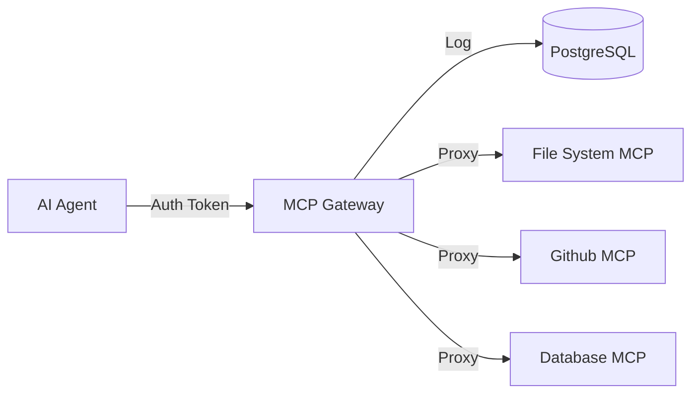

# MCP Gateway

**A production-ready, secure gateway for the Model Context Protocol (MCP).**

## 🚀 What is this?
The **MCP Gateway** is a centralized middleware server designed to manage, secure, and observe interactions between Large Language Model (LLM) agents and your infrastructure tools. 

Instead of giving agents direct, unchecked access to your internal APIs or databases, you route them through the Gateway. This allows you to enforce permissions, rate limits, and audit all tool usage.

## 🎯 Who is this for?
- **Enterprise Engineering Teams**: Who need to expose internal tools to AI agents safely within a corporate environment.
- **Platform Engineers**: Building "Agent Platforms" who need a standard way to govern tool access across many different agents.
- **Security Teams**: Who demand audit trails (logging every tool call) and strict RBAC (Role-Based Access Control) for AI systems.

## ✨ Key Features
- **🛡️ Granular Security**: 
  - **RBAC**: Define exactly which user/agent roles can access which tools.
  - **JWT Authentication**: Secure access using standard tokens.
- **🚦 Traffic Control**:
  - **Rate Limiting**: Prevent abuse with per-user and per-tool quotas.
  - **Load Protection**: Payload size limits and backend timeouts.
- **🔍 Observability**:
  - **Audit Logging**: Every single tool invocation is logged to the database for compliance.
  - **Structured Logging**: JSON-formatted logs for easy ingestion into Splunk/Datadog.
- **⚡ Asynchronous Jobs**:
  - Support for long-running tool executions with status polling.
- **🔌 Standard MCP Support**:
  - Proxies JSON-RPC 2.0 requests to any compliant MCP server.

## 🏗️ Architecture
The Gateway sits between your Agents (Clients) and your MCP Servers (Backends):



## 🛠️ Quick Start

### Prerequisites
- Python 3.11+
- Docker & Docker Compose

### Fast Launch
1. **Clone and Configure**:
   ```bash
   cp example.env .env
   ```
2. **Start Infrastructure (Postgres)**:
   ```bash
   docker-compose up -d
   ```
3. **Run Server**:
   ```bash
   # Create venv and install dependencies
   python -m venv .venv
   source .venv/bin/activate  # or .venv\Scripts\activate on Windows
   pip install -r requirements.txt
   
   # Run migrations
   alembic upgrade head
   
   # Start API
   uvicorn src.main:app --reload
   ```

### Documentation
- [Deployment Guide](docs/deployment.md) - Detailed configuration and Docker setup.
- [/docs](http://localhost:8000/docs) - Interactive API documentation (Swagger UI).

## 🧪 Testing
Run the test suite with coverage reporting:
```bash
pytest --cov=src
```
