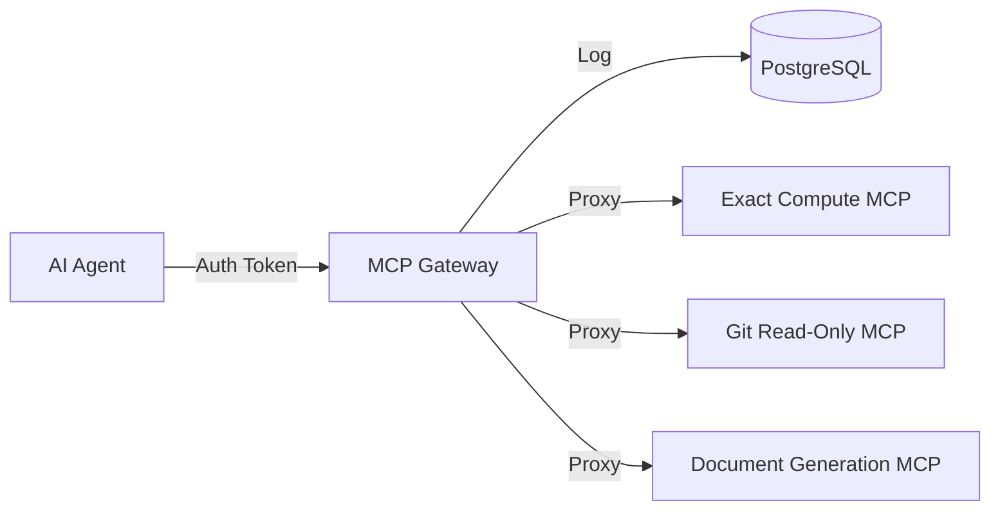

# MCP Gateway

**A production-ready, secure gateway for the Model Context Protocol (MCP).**

## 🚀 What is this?
The **MCP Gateway** is a centralized middleware server designed to manage, secure, and observe interactions between Large Language Model (LLM) agents and your infrastructure tools.

Instead of giving agents direct, unchecked access to your internal APIs or databases, you route them through the Gateway. This allows you to enforce permissions, rate limits, and audit all tool usage.

## 🎯 Who is this for?
- **Enterprise Engineering Teams**: Who need to expose internal tools to AI agents safely within a corporate environment.
- **Platform Engineers**: Building "Agent Platforms" who need a standard way to govern tool access across many different agents.
- **Security Teams**: Who demand audit trails (logging every tool call) and strict RBAC (Role-Based Access Control) for AI systems.

## ✨ Key Features
- **🛡️ Granular Security**:
  - **RBAC**: Define exactly which user/agent roles can access which tools.
  - **JWT Authentication**: Validate upstream-authenticated tokens.
- **🚦 Traffic Control**:
  - **Rate Limiting**: Prevent abuse with per-user and per-tool quotas.
  - **Load Protection**: Payload size limits and backend timeouts.
- **🔍 Observability**:
  - **Audit Logging**: Every single tool invocation is logged to the database for compliance.
  - **Structured Logging**: JSON-formatted logs for easy ingestion into Splunk/Datadog.
- **⚡ Asynchronous Jobs**:
  - Support for long-running tool executions with status polling.
- **🔌 Standard MCP Support**:
  - Proxies JSON-RPC 2.0 requests to compliant MCP tool servers.

## 🏗️ Architecture
The Gateway sits between your Agents (Clients) and your MCP Servers (Backends):



## 🧰 v1 Tool Set
Exactly three tool categories are supported in v1:
- **Calculator**: Deterministic math, statistics, unit conversion (✅ Implemented).
- **Git**: Read-only repository history and search (Planned).
- **Document Generator**: Deterministic PDF/DOCX/HTML generation (✅ Implemented).

Each tool is a separate containerized service and exposes:
- `GET /health`
- `POST /mcp` (JSON-RPC 2.0 tool call endpoint)

## 🔍 Smart Routing (Meta-Tools)

As your tool registry grows, exposing all tools via `tools/list` creates scalability issues. The Gateway implements a **meta-tool pattern** for dynamic discovery:

### Core Tools (Always Available)
| Tool | Description |
|------|-------------|
| `find_tools` | Search for tools by describing what you want to do |
| `call_tool` | Invoke a discovered tool by name with arguments |

### Usage Flow
```
1. LLM calls find_tools("generate PDF document")
   → Returns: document_generate schema with inputSchema

2. LLM calls call_tool(name="document_generate", arguments={...})
   → Returns: Generated document result
```

### Example
```python
# Discover tools
find_tools(query="convert units", max_results=3)
# Returns schemas for: exact_convert_units, exact_unit_arithmetic

# Invoke discovered tool  
call_tool(
    name="exact_calculate",
    arguments={"operator": "mul", "operands": ["1100", "0.09290304"]}
)
# Returns: {"result": "102.193344"}
```

This pattern scales to 100s of tools while keeping the initial tool list minimal.

## 🗂️ Tool Registry (Static)
Tool definitions live in `config/tools.yaml` and are synced into the registry at gateway startup. Access is filtered by `config/policy.yaml`.

By default, `config/tools.yaml` uses Docker Compose service names. If you run tools outside Docker, update `backend_url` values to reachable hostnames/ports.

## 🧪 Development Deployment (Docker Compose)

### Prerequisites
- Docker & Docker Compose

### 1) Configure
```bash
cp example.env .env
```
Set `JWT_SECRET_KEY` and `JWT_ALGORITHM` to match your upstream auth system.

### 2) Build and Start (Locked Networking)
```bash
docker compose up -d --build
```
This brings up:
- `gateway` (exposed on port 8000)
- `db` (internal network only)
- `calculator` (internal network only)
- `document_generator` (internal network only)

Tools are not exposed to the host; the gateway is the only entrypoint.

### 3) Build and Start (Dev Ports)
```bash
docker compose -f docker-compose.yml -f docker-compose.dev.yml up -d --build
```
This publishes database and tool ports for local debugging while keeping the internal network in place.

### 4) Invoke a Tool (Example)
Generate a test JWT (development only):
```bash
python -c "from src.auth.utils import create_test_jwt; print(create_test_jwt(user_id='demo', roles=['developer']))"
```

Then call the gateway:
```bash
  -H "Content-Type: application/json" \
  -d '{"tool_name":"exact_compute","arguments":{"operation":"arithmetic","params":{"operator":"add","operands":["1.2","2.3"],"precision":28}}}'
```

### 5) Connect via Antigravity (or other MCP Clients)
Since Antigravity requires stdio-based communication, use `mcp-bridge` to connect to the Gateway's SSE endpoint.

**Config:**
```json
{
  "mcpServers": {
    "gateway": {
      "command": "npx",
      "args": [
        "-y",
        "@nimbletools/mcp-http-bridge",
        "--endpoint",
        "http://localhost:8000/sse",
        "--token",
        "YOUR_JWT_TOKEN_HERE"
      ]
    }
  }
}
```
*Note: Ensure your JWT token is valid and the `src` volume is mounted in Docker for development.*

## 🧪 Development Deployment (Local Python)

### Prerequisites
- Python 3.11+
- Docker & Docker Compose (for Postgres and tools)

### 1) Configure
```bash
cp example.env .env
```
Update `DATABASE_URL` to point at your local Postgres (for example `localhost:5432`), and set `JWT_SECRET_KEY`/`JWT_ALGORITHM`.

If the gateway runs on the host, update `config/tools.yaml` to point at `http://localhost:8091/mcp` (and future tool ports) or mount a host-specific config file.

### 2) Start Infrastructure and Tools
```bash
docker compose -f docker-compose.yml -f docker-compose.dev.yml up -d db calculator document_generator
```

### 3) Run Gateway
```bash
python -m venv .venv
source .venv/bin/activate  # or .venv\Scripts\activate on Windows
pip install -r requirements.txt

alembic upgrade head
uvicorn src.main:app --reload --host 0.0.0.0 --port 8000
```

## 🏭 Production Deployment

### Gateway
1. Build the gateway image:
   ```bash
   docker build -t mcp-gateway .
   ```
2. Run Postgres externally and point `DATABASE_URL` to it.
3. Run the gateway with production env:
   - `DEBUG=False`
   - `JWT_SECRET_KEY` and `JWT_ALGORITHM` set to production values
   - `DATABASE_URL` set to your production database
4. Mount `config/tools.yaml` and `config/policy.yaml` as read-only in the container.
5. Run `alembic upgrade head` during deploys to apply schema changes.

### Tools
- Build and deploy each tool as its own container image.
- Ensure each tool exposes `POST /mcp` and is reachable at the `backend_url` configured in `config/tools.yaml`.
- Keep tools stateless and offline-safe; no auth logic inside tools.

## 📖 Documentation
- [Deployment Guide](docs/deployment.md)
- [/docs](http://localhost:8000/docs) - Interactive API documentation (Swagger UI)

## 🧪 Testing
Run the test suite with coverage reporting:
```bash
pytest --cov=src
```
