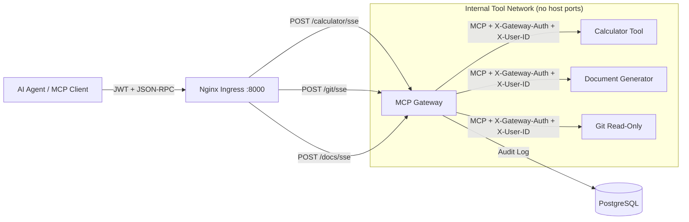

# Security Diagram

```mermaid
flowchart LR
    Client[AI Agent / MCP Client]
    Ingress[Nginx Ingress :8000]
    Gateway[MCP Gateway]
    DB[(PostgreSQL)]
    Calc[Calculator Tool]
    Docs[Document Generator]
    Git[Git Read-Only]

    Client -->|JWT + JSON-RPC| Ingress
    Ingress -->|POST /calculator/sse| Gateway
    Ingress -->|POST /git/sse| Gateway
    Ingress -->|POST /docs/sse| Gateway
    Gateway -->|Audit Log| DB

    subgraph Internal_Network["Internal Tool Network (no host ports)"]
        Gateway -->|MCP + X-Gateway-Auth + X-User-ID| Calc
        Gateway -->|MCP + X-Gateway-Auth + X-User-ID| Docs
        Gateway -->|MCP + X-Gateway-Auth + X-User-ID| Git
    end
```
